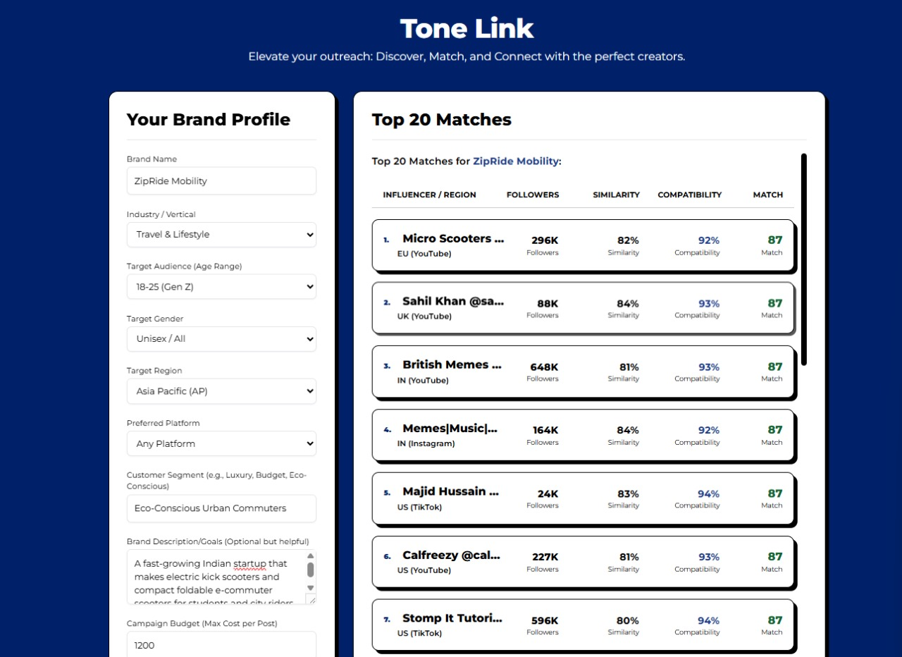

# influencer-ml-pipeline

Python ML pipeline integrating multiple influencer analytics models to generate ranked recommendations for brand campaigns. This README explains how to install dependencies, run the web server and frontend, and (re)generate model artifacts used by the project.

**Quick overview**
- Backend API: FastAPI app at `api/api.py` served with Uvicorn via `main.py`.
- Frontend: static site in `frontend/` (HTML + JS) that talks to the API.
- Models & pipeline: code under `pipeline/` produces embeddings and score predictions.

## UI Preview

Below are example screenshots of the frontend interface.



<!-- <p float="left">
  
  
</p> -->

**Contents of this README**
- Prerequisites
- Install dependencies
- Run the backend API (development)
- Run the frontend (development)
- Generate / update model artifacts
- Notes & troubleshooting

## Prerequisites

- Python 3.10+ (3.11 recommended). Create and use a virtual environment.
- Git (to clone repository) and network access to download models and packages.
- Optional: GPU and matching PyTorch/CUDA build if you plan to use GPU acceleration for model encoding/training. CPU-only works but will be slower.

## Install dependencies

1. Open a terminal (PowerShell on Windows).
2. Create and activate a virtual environment (recommended):

```powershell
python -m venv .venv
.\.venv\Scripts\Activate.ps1
# Or use: .\.venv\Scripts\activate
```

3. Install pinned requirements from `requirements.txt`:

```powershell
python -m pip install --upgrade pip
pip install -r requirements.txt
```

Notes:
- The `requirements.txt` in this repo is pinned to specific versions for reproducibility. If you need to change versions (e.g., to support a newer PyTorch/CUDA), update the file and test carefully.
- Some packages (notably `torch`) have platform-specific wheels. If `pip install torch` fails, follow the instructions at https://pytorch.org/get-started/locally/ to install a matching wheel for your OS/CUDA.

## Run the backend API (development)

1. From the repository root, with the virtualenv activated, run the FastAPI backend:

```powershell
# run from repo root
python main.py
# or directly via uvicorn for autoreload during development
uvicorn main:app --reload --host 0.0.0.0 --port 8000
```

2. The API will be reachable at `http://localhost:8000`. The FastAPI automatic docs are available at `http://localhost:8000/docs` (Swagger UI) and `http://localhost:8000/redoc`.

3. Key backend files:
- `main.py` — application bootstrap and CORS setup.
- `api/api.py` — API router and endpoints that wrap pipeline functionality.
- `input_embedder.py` and `pipeline/pip.py` — model loading and inference helpers.

## Run the frontend (development)

The frontend is a simple static site in `frontend/` that calls the backend API.

1. Open `frontend/index.html` in a browser, or serve it from a local static server.

2. If you want to host it with a simple Python server (for local testing):

```powershell
cd frontend
python -m http.server 3000
# then open http://localhost:3000 in your browser
```

3. The frontend expects the backend API to be reachable at the origins configured in `main.py` (CORS). During development both can run on the same machine.

## Generate / update model artifacts

This project contains code to compute embeddings, train/persist models, and generate auxiliary artifacts (CSV/NPY files) used by the API.

Common tasks and where to run them:

- Compute influencer / brand embeddings: see `input_embedder.py` and `pipeline/bert-embeddings/`. These scripts use Hugging Face `transformers` / `sentence-transformers` and PyTorch. Example usage pattern:

```powershell
# run from repo root
python input_embedder.py --input content/brand_data.csv --output embeddings/brand_embeddings.npy
# or run specific pipeline module; check docstrings in pipeline/ for usage
```

- Run the full pipeline (integrator + scorer):

```powershell
python -c "from pipeline.pip import load_models; load_models()"
# or call pipeline entrypoints used by api endpoints (see api/api.py)
```

- Training (if applicable): If pipeline modules include training routines (check `pipeline/*`), run them inside the virtualenv and ensure dataset CSVs are present under `content/`.

Notes when generating models:
- Large pretrained model downloads will be cached by Hugging Face in `~/.cache/huggingface/` by default. Ensure you have disk space.
- For reproducibility, pin the model names used by the code (the code usually references model IDs on Hugging Face hub).

## File locations of interest

- `frontend/` — static UI.
- `api/` — FastAPI router and API surface.
- `main.py` — app entrypoint.
- `input_embedder.py` — model tokenizer/encoder helpers.
- `pipeline/` — pipeline modules for embeddings, classification, integrator, scoring.
- `embeddings/` and `content/` — stored artifacts and datasets.

## Troubleshooting

- If `pip install -r requirements.txt` fails for `torch`: install PyTorch via the official instructions (https://pytorch.org/get-started/locally/).
- If you see model download timeouts from Hugging Face, retry or download models manually and set `TRANSFORMERS_CACHE` / `HF_HOME` environment variables to point to a local cache.
- If the API fails to start due to import errors, check that your virtualenv is activated and that `pip install -r requirements.txt` completed without errors.

## Optional: Validate environment

After installing, you can run:

```powershell
python -c "import pkg_resources; print('\n'.join(sorted([str(d) for d in pkg_resources.working_set])))"
# or run pip check
pip check
```

## Contributing / Next steps

- If you update dependencies, run the pipeline end-to-end locally and verify the API endpoints still work.
- Add any additional runtime notes into this README (e.g., special instructions for deploying to production or containerization via Docker).

---

If you'd like, I can also:
- Add an example `docker-compose.yml` to run the API + static site.
- Run `pip check` locally here and list any conflicts (I will need permission to run commands in your environment).
- Create small helper scripts to run common pipeline tasks (compute embeddings, run scorer) from the command line.

Tell me which you'd prefer next.
